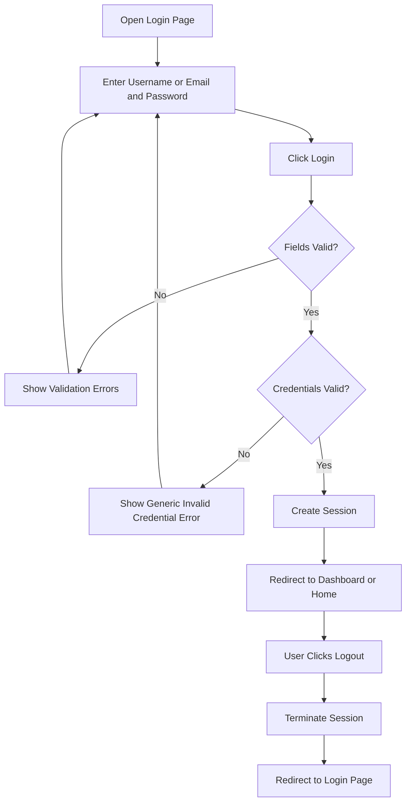

# SRS-to-JIRA-Automation

This repository stores project SRS artifacts and supports conversion into a Jira-ready backlog.

## Project SRS Reference

- SRS document: `src/project_srs.md`
- Current module in scope: `Login Flow Module` (Version 1.0, March 25, 2026)

## Scope Summary

In scope:
- Login screen
- Credential/input validation
- Authentication
- Session creation and maintenance
- Logout
- Access control for protected pages

Out of scope:
- Registration / Sign Up
- Forgot Password
- Social login
- Multi-factor authentication
- User profile management

## Flow Structure Chart (Module View)

```mermaid
flowchart TD
    A[Login Flow Module] --> B[Login UI]
    A --> C[Validation Layer]
    A --> D[Authentication Service]
    A --> E[Session Management]
    A --> F[Access Control]

    B --> B1[Username or Email Input]
    B --> B2[Password Input (Masked)]
    B --> B3[Login Button]
    B --> B4[Error Message Area]

    C --> C1[Required Field Validation]
    C --> C2[Email Format Validation]

    E --> E1[Create Session on Success]
    E --> E2[Terminate Session on Logout]
    E --> E3[Session Expiry on Inactivity]
```

## Login Flow Chart (Use Case View)



## Requirements Table (SRS-Aligned)

| Area | Key Requirements |
| --- | --- |
| Login Page | FR-1, FR-2, FR-3 |
| Input Validation | FR-4, FR-5, FR-6, FR-7 |
| Authentication | FR-8, FR-9, FR-10, FR-11 |
| Successful Login | FR-12, FR-13, FR-14 |
| Logout | FR-15, FR-16, FR-17 |
| Access Control | FR-18, FR-19 |
| Security | NFR-1, NFR-2, NFR-3, NFR-4, NFR-5 |
| Performance | NFR-6 |
| Usability | NFR-7, NFR-8 |
| Reliability | NFR-9 |
| Compatibility | NFR-10 |
