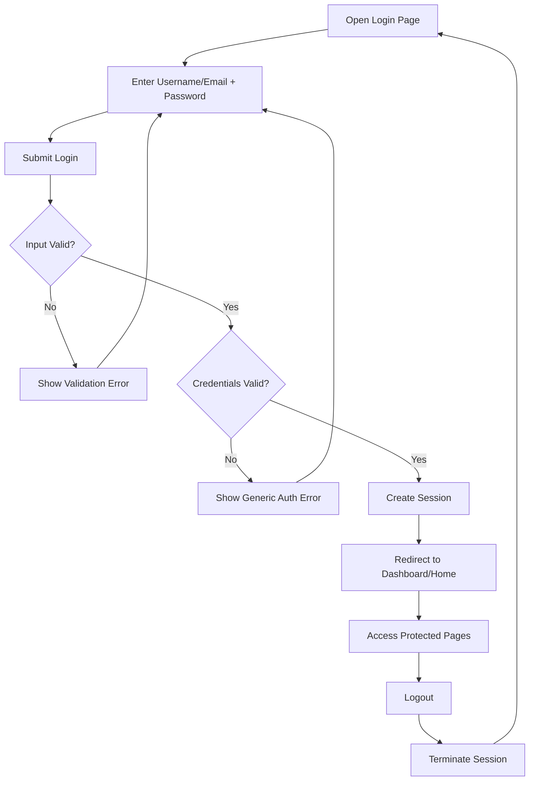
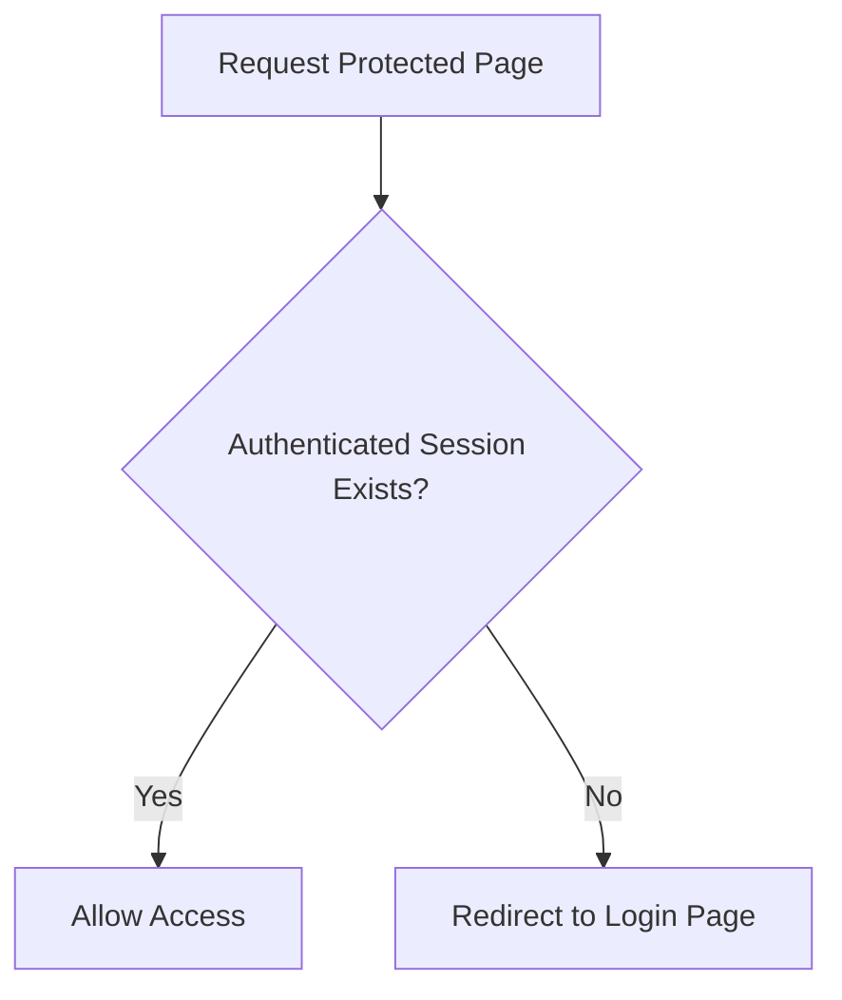

# SRS-to-JIRA-Automation

This repository stores SRS artifacts and automation assets for converting SRS documents into Jira-ready backlogs.

## Project SRS Summary (Login Flow Module)

The current SRS (`src/project_srs.md`) defines requirements for user login, authentication, session handling, logout, and protected page access control.

## Flow Structure Chart: High-Level Module Flow



## Flow Structure Chart: Access Control Decision



## SRS Requirement Coverage Table

| Area | SRS IDs | Expected System Behavior |
| --- | --- | --- |
| Login screen | FR-1, FR-2, FR-3 | Provide username/email and password fields, masked password input, and Login button. |
| Input validation | FR-4, FR-5, FR-6, FR-7 | Validate required fields and email format; show field/form error messages. |
| Authentication | FR-8, FR-9, FR-10, FR-11 | Authenticate against stored data; allow valid users and reject invalid credentials with generic error text. |
| Successful login/session | FR-12, FR-13, FR-14 | Create authenticated session and redirect user to dashboard/home; keep session active until logout/expiry. |
| Logout | FR-15, FR-16, FR-17 | Provide logout option, terminate active session, and return user to login page. |
| Access control | FR-18, FR-19 | Prevent unauthenticated access to protected pages and redirect to login if attempted. |
| Security | NFR-1, NFR-2, NFR-3, NFR-4, NFR-5 | Mask/store passwords securely, use HTTPS, do not expose which credential failed, and expire inactive sessions. |
| Performance/usability/reliability/compatibility | NFR-6, NFR-7, NFR-8, NFR-9, NFR-10 | Keep login responsive, clear, available, and compatible with modern browsers/mobile layouts. |

## Environment note

GitHub CLI (`gh`) installation is handled by the Codex environment setup script at `/opt/codex/setup_universal.sh`.
GitHub API automation also requires a `GH_TOKEN` environment variable to be set in the runtime environment.

## Foundation Modules

This repository now includes baseline application modules for the login flow implementation:

- `frontend/`: Next.js + TypeScript + Tailwind CSS structure
- `backend/`: Node.js ESM service structure

## Local Development Setup

Run these commands from the repository root:

```bash
npm install
npm run test --workspace frontend
npm run test --workspace backend
```

Start development servers:

```bash
npm run dev --workspace frontend
npm run dev --workspace backend
```

## PR Check Command

Use the following command in CI for pull requests:

```bash
npm run ci:pr
```

This runs linting and tests for both `frontend` and `backend`.
